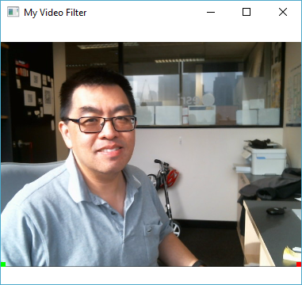

This is a sample video filter application.

The applications paints a green square into the QVideoFrame at (0, 0) and a red square at (Width-1, 0). Dependending on the device, you will find the green and red square at interesting places due device specific orientation and flip differences. For instance, on Windows, the (0, 0) can be found on the bottom left hand corner.



The QML code shows how to use the custom filter, for example:

```qml
    Camera {
        id: camera
    }
    
    VideoOutput {
        source: camera
        filters: [ videoFilter ]
    }
    
    MyVideoFilter {
        id: videoFilter
    }
```

The C++ code shows how to implement QAbstractVideoFilter, for example:

```c++
    class MyVideoFilter: public QAbstractVideoFilterRunnable
    {
        Q_OBJECT
    public:
        QVideoFilterRunnable* createFilterRunnable() Q_DECL_OVERRIDE;
    };
    
    class CMyVideoFilterRunnable : public QVideoFilterRunnable
    {
    public:
        QVideoFrame run(QVideoFrame *input, const QVideoSurfaceFormat &surfaceFormat, RunFlags flags) Q_DECL_OVERRIDE;
    };
```

Same key features:

 - For non-Android, using Qt's qt_imageFromVideoFrame() to convert a `QVideoFrame` to a `QImage`.
 - For Android, using the GLTextureHandle to obtain a `QImage`.
 - Using the `videoOutput.orientation` parameter to discover the rotation in the `QImage`.
 - Using `surfaceFormat` to discover the flip in `QImage`.

References:
  http://doc.qt.io/qt-5/qabstractvideobuffer.html
